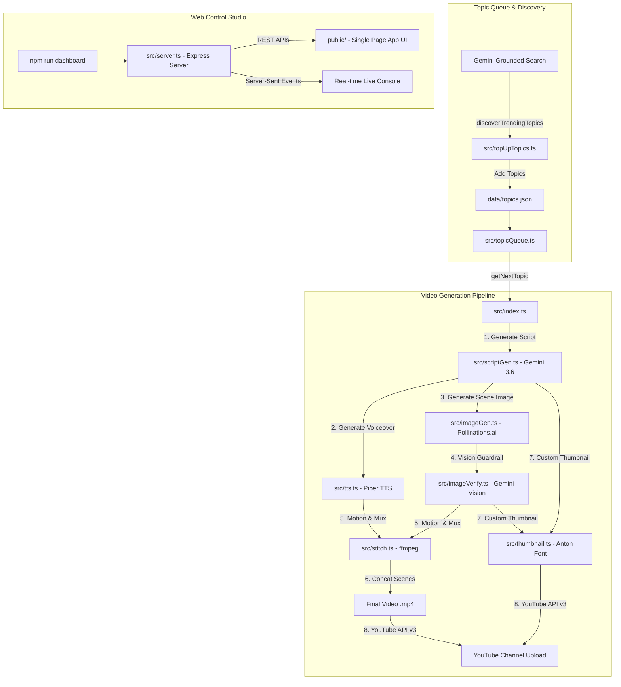

# YouTube Automation Pipeline & Control Studio — Architecture & Technical Guide

Welcome to the complete documentation for the **Automated YouTube Video Generation & Channel Management System**. This project is a production-grade, end-to-end automated solution that handles **topic research, scriptwriting, voiceover synthesis, image generation & verification, motion animation, video stitching, thumbnail rendering, YouTube upload, and web dashboard management**.

---

## 📐 1. System Architecture & Workflow



---

## 📺 2. Supported YouTube Channels

The pipeline currently automates **three distinct brand accounts** under one Google YouTube login:

| Channel ID | Display Name | Language | Aspect Ratio | Target Audience / Niche | Voice Model |
|---|---|---|---|---|---|
| `bharatkaal` | **BharatKaal** | Hindi | 16:9 | Indian history, ancient/medieval empires & battles | `hi_IN-pratham-medium` |
| `heritage_unfolded` | **Heritage Unfolded** | English | 16:9 | Indian architecture, temples, stepwells & heritage | `en_US-lessac-medium` |
| `bloop_and_boo` | **Bloop and Boo** | English | 9:16 (Shorts) | Wholesome children's storybooks & moral lessons | `en_US-amy-medium` |

---

## 🛠️ 3. Core Modules & Implementation Deep-Dive

### 📡 A. Topic Queue & AI Research (`src/topicQueue.ts`, `src/topicDiscovery.ts`, `src/topUpTopics.ts`)
- **Queue Management**: Topics are stored in `data/topics.json` with status `"pending"` or `"done"`.
- **Auto Topic Top-up**: `src/topicDiscovery.ts` uses Gemini's Google Search grounding tool to research trending news, anniversaries, and rising searches per channel niche, then structures them into JSON titles.
- **Resiliency & Fallbacks**: Features 12-second request pacing and fallback logic that gracefully degrades to internal AI knowledge if web search quotas are reached.

### 📝 B. Script Generation (`src/scriptGen.ts`)
- Uses `gemini-3-flash-preview` to output structured JSON containing:
  - `videoTitle`: Catchy YouTube title.
  - `description`: Detailed description with relevant hashtags.
  - `scenes`: Array of scene narrations and detailed, culturally-anchored visual image prompts.

### 🎙️ C. Local Voice Synthesis (`src/tts.ts`)
- **100% Free & Local**: Executes the ONNX-based **Piper TTS** binary offline with zero API cost.
- Matches each channel to its specific neural voice model stored in `voices/`.

### 🎨 D. Image Generation & Vision Guardrails (`src/imageGen.ts`, `src/imageVerify.ts`)
- **Pollinations.ai Integration**: Generates crisp, full-resolution scene images based on the script prompt.
- **Cultural Accuracy Anchors**: Appends explicit regional guardrails (`imageAccuracyAnchor` in `config.ts`) to prevent AI drift (e.g. rendering Indian historical rulers with incorrect Central Asian or European attire).
- **Gemini Vision Verification**: Validates generated images using Gemini's vision model. If inaccurate, it auto-regenerates with corrected prompt directives.

### 🎬 E. Video Motion & Stitching (`src/stitch.ts`)
- Cycles through **Ken Burns pan/zoom motion presets** (Zoom In, Zoom Out, Pan Left, Pan Right) via `ffmpeg` so scenes have dynamic visual motion.
- Muxes scene audio with video and concatenates all scenes into a final `.mp4`.

### 🖼️ F. Thumbnail Creation & YouTube Upload (`src/thumbnail.ts`, `src/upload.ts`)
- **Thumbnail Engine**: Automatically takes scene #1, crops to 16:9, and renders high-impact bold typography with a semi-transparent legibility background using the bundled `Anton-Regular.ttf` font.
- **YouTube API v3**: Uploads the video, sets title/description/tags/kids settings, and attaches the custom thumbnail.

### 🌐 G. Web Control Studio (`src/server.ts`, `public/`)
- Express REST API & Server-Sent Events (SSE) server.
- Provides a dark-mode Web Dashboard (`http://localhost:3000`) to:
  - View & search pending and completed topics per channel.
  - Add custom manual topics to any channel queue.
  - Trigger **Topic Top-Up** or **Video Generation Pipeline** for single or all channels with **real-time streaming console logs**.

---

## 💻 4. Command Reference

| Command | Description |
|---|---|
| `npm run dashboard` | Launch the Web Control Studio at `http://localhost:3000` |
| `npm run pipeline:all` | Generate and upload videos for **all 3 channels** in sequence |
| `CHANNEL=bharatkaal npm run pipeline` | Generate and upload video for a **specific channel** |
| `npm run topup-topics:all` | Check queues and auto-research topics for **all channels** |
| `CHANNEL=heritage_unfolded npm run topup-topics` | Research topics for a **specific channel** |
| `npm run get-youtube-token` | Run one-time OAuth token flow for YouTube brand accounts |

---

## 📂 5. Directory Map

```
video-pipeline/
├── assets/fonts/               # Anton-Regular.ttf for custom thumbnail text overlay
├── data/
│   └── topics.json             # Persistent storage of pending and completed topics
├── public/                     # Web Control Studio frontend
│   ├── index.html              # Single-page app dashboard
│   ├── style.css               # Glassmorphism dark CSS theme
│   └── app.js                  # Frontend state management & SSE stream client
├── src/
│   ├── config.ts               # Channel parameters, voices, aspect ratios, & accuracy anchors
│   ├── imageGen.ts             # Pollinations.ai image generator
│   ├── imageVerify.ts          # Gemini Vision guardrail & prompt verifier
│   ├── index.ts                # Main pipeline orchestrator
│   ├── retry.ts                # Exponential backoff & rate-limit throttling
│   ├── scriptGen.ts            # Gemini script generator
│   ├── server.ts               # Express web dashboard & SSE process runner
│   ├── stitch.ts               # ffmpeg pan/zoom motion & audio video stitcher
│   ├── thumbnail.ts            # Canvas/Font thumbnail renderer
│   ├── topUpTopics.ts          # Auto topic discovery runner
│   ├── topicDiscovery.ts       # Grounded search AI research module
│   ├── topicQueue.ts           # JSON topics queue CRUD helpers
│   ├── tts.ts                  # Piper TTS voiceover generator
│   ├── upload.ts               # YouTube Data API v3 uploader
│   └── paid/                   # (Parked) Veo AI Video Motion & Gemini TTS modules
├── voices/                     # Local Piper ONNX voice models
├── package.json                # Project dependencies and script commands
└── README.md                   # Setup & quick-start guide
```

---

## 💎 6. Paid Upgrade Path (Veo + Gemini TTS)

If you ever wish to upgrade from the $0 free-tier setup to Google's paid **Veo AI Video Motion** and **Gemini TTS**:
1. Swap `generateSceneImage` + `animateImage` calls in `src/index.ts` with `generateClip()` from `src/paid/veo.ts`.
2. Swap `generateVoiceover` in `src/index.ts` with `src/paid/tts.ts`.
3. Configuration for `veoModel` and `ttsVoice` is already pre-configured in `src/config.ts`.
